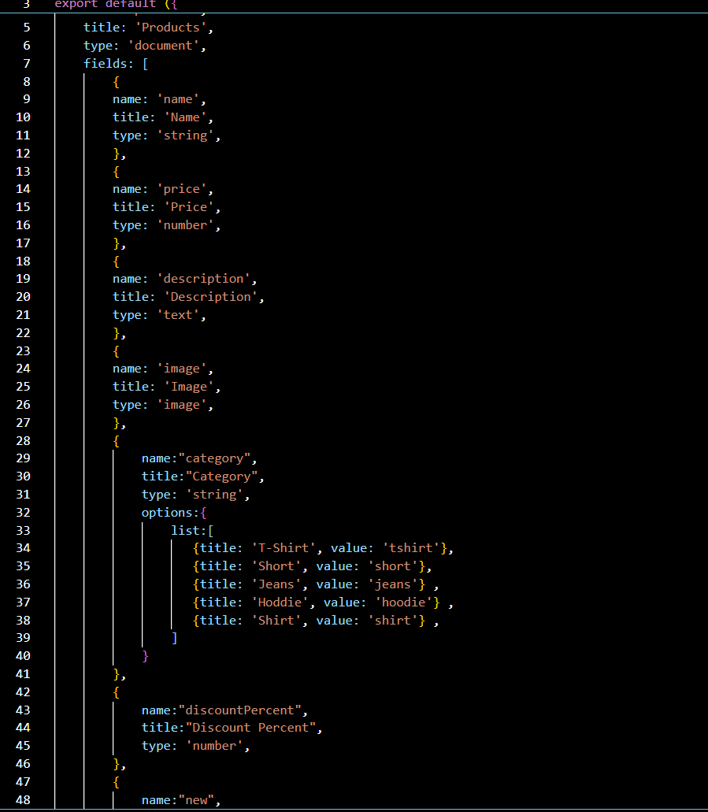

This is a [Next.js](https://nextjs.org) project bootstrapped with [`create-next-app`](https://nextjs.org/docs/app/api-reference/cli/create-next-app).

## Getting Started

First, run the development server:

```bash
npm run dev
# or
yarn dev
# or
pnpm dev
# or
bun dev
```

Open [http://localhost:3000](http://localhost:3000) with your browser to see the result.

You can start editing the page by modifying `app/page.tsx`. The page auto-updates as you edit the file.

This project uses [`next/font`](https://nextjs.org/docs/app/building-your-application/optimizing/fonts) to automatically optimize and load [Geist](https://vercel.com/font), a new font family for Vercel.

## Learn More

To learn more about Next.js, take a look at the following resources:

- [Next.js Documentation](https://nextjs.org/docs) - learn about Next.js features and API.
- [Learn Next.js](https://nextjs.org/learn) - an interactive Next.js tutorial.

You can check out [the Next.js GitHub repository](https://github.com/vercel/next.js) - your feedback and contributions are welcome!

## Deploy on Vercel

The easiest way to deploy your Next.js app is to use the [Vercel Platform](https://vercel.com/new?utm_medium=default-template&filter=next.js&utm_source=create-next-app&utm_campaign=create-next-app-readme) from the creators of Next.js.

Check out our [Next.js deployment documentation](https://nextjs.org/docs/app/building-your-application/deploying) for more details.
# hackathon



<!-- # Day 3 Documentation  
**Date:** [Insert Date]  
**Project:** [Insert Project Name]  

---

### **Objective:**  
- Aaj ka goal tha API ko Sanity CMS mein store karna aur wahan se data ko fetch karke frontend par display karna.  

---

### *Meri Day 3 ki Journey**  

#### 1. Planning aur Preparation**  
Sabse pehle maine plan kiya ke API integration ka kaam kaise hoga. Tools ready kiye:  
- *Sanity CMS* ko setup kiya data management ke liye.  
- Frontend ke liye *Next.js aur Tailwind CSS* ka use kiya.  

#### *2. API ka Sanity mein Integration**  
- API se data fetch kiya aur usse Sanity CMS ke schema ke andar store kiya.  
- Sanity mein custom schemas banaye, jaise:  
  - *Product Schema* (fields: name, price, description, image, etc.).  
  - *Category Schema* (fields: title, slug, etc.).  
- Sanity dashboard mein manually verify kiya ke data sahi tarah se aa raha hai aur store ho raha hai.  

#### *3. Sanity se Data ko Frontend par Lana**  
- Sanity ka `@sanity/client` package install kiya aur configure kiya.  
- GROQ queries likh kar Sanity CMS se data fetch kiya, jaise:  


```javascript
const query = `*[_type == "product"] { name, price, description, image }`;
const products = await sanityClient.fetch(query);

```
- Fetched data ko components mein pass kiya aur dynamic rendering kiya. 


###  *4. UI Design aur Display***  
- Tailwind CSS ka use karke frontend UI ko design kiya.  
- Products aur categories ko responsive grid mein display kiya.  
- Data ko properly format karne ke liye mapping aur conditional rendering ka use kiya.  


#### *5. Testing aur Debugging*  
- Sanity se API calls ko test kiya aur ensure kiya ke data correctly fetch ho raha hai.  
- Frontend par data render karte waqt jo bugs aaye, unko fix kiya.  

---

### *Achievements*  
- Successfully Sanity CMS mein API ka data store kiya.  
- Data ko Sanity se fetch karke frontend par display kar diya.  
- UI responsive aur clean ban gayi. -->


# Hackathon Day 2

## Sanity Schema Design: Product Schema:


## API Endpoints:

| Endpoints                | Method | Description                     |
|--------------------------|--------|---------------------------------|
| `/Products`              | GET    | Fetches all products           |
| `/Products/id`           | GET    | Fetches a specific product     |
| `/Orders`                | POST   | Creates a new order            |
| `/Orders/id`             | GET    | Fetches a specific order       |
| `/shipment/tracking/id`  | GET    | Tracks shipment status         |

### Product Schema:
```javascript
export const product = {
  name: 'product',
  type: 'document',
  fields: [
    { name: 'name', type: 'string', title: 'Product Name' },
    { name: 'price', type: 'number', title: 'Price' },
    { name: 'description', type: 'text', title: 'Description' },
    { name: 'image', type: 'image', title: 'Product Image' },
    { name: 'category', type: 'string', title: 'Category' }
  ]
};
```

### Order Schema:
```javascript
export const order = {
  name: 'order',
  type: 'document',
  fields: [
    { name: 'orderNumber', type: 'string', title: 'Order Number' },
    { name: 'customer', type: 'reference', to: [{ type: 'customer' }], title: 'Customer' },
    { name: 'products', type: 'array', of: [{ type: 'reference', to: [{ type: 'product' }] }], title: 'Products' },
    { name: 'totalAmount', type: 'number', title: 'Total Amount' },
    { name: 'status', type: 'string', title: 'Order Status' }
  ]
};
```

### Customer Schema:
```javascript
export const customer = {
  name: 'customer',
  type: 'document',
  fields: [
    { name: 'name', type: 'string', title: 'Customer Name' },
    { name: 'email', type: 'string', title: 'Email' },
    { name: 'address', type: 'text', title: 'Address' },
    { name: 'phone', type: 'string', title: 'Phone Number' }
  ]
};
```

## Technical Documentation:

### 1. System Architecture:


#### 1.1 Components:
- **Frontend (Next.js):** Handles user interface and interactions.
- **Sanity CMS:** Used for content management and data storage.
- **Third-party APIs:** Integrated for shipment tracking and payments.

### 2. API Endpoints:

| Endpoints                | Method | Description                     |
|--------------------------|--------|---------------------------------|
| `/Products`              | GET    | Fetches all products           |
| `/Products/id`           | GET    | Fetches a specific product     |
| `/Orders`                | POST   | Creates a new order            |
| `/Orders/id`             | GET    | Fetches a specific order       |
| `/shipment/tracking/id`  | GET    | Tracks shipment status         |

### 3. Sanity Schemas:

#### Product Schema:
```javascript
export const product = {
  name: 'product',
  type: 'document',
  fields: [
    { name: 'name', type: 'string', title: 'Product Name' },
    { name: 'price', type: 'number', title: 'Price' },
    { name: 'description', type: 'text', title: 'Description' },
    { name: 'image', type: 'image', title: 'Product Image' },
    { name: 'category', type: 'string', title: 'Category' }
  ]
};
```

#### Order Schema:
```javascript
export const order = {
  name: 'order',
  type: 'document',
  fields: [
    { name: 'orderNumber', type: 'string', title: 'Order Number' },
    { name: 'customer', type: 'reference', to: [{ type: 'customer' }], title: 'Customer' },
    { name: 'products', type: 'array', of: [{ type: 'reference', to: [{ type: 'product' }] }], title: 'Products' },
    { name: 'totalAmount', type: 'number', title: 'Total Amount' },
    { name: 'status', type: 'string', title: 'Order Status' }
  ]
};
```

#### Customer Schema:
```javascript
export const customer = {
  name: 'customer',
  type: 'document',
  fields: [
    { name: 'name', type: 'string', title: 'Customer Name' },
    { name: 'email', type: 'string', title: 'Email' },
    { name: 'address', type: 'text', title: 'Address' },
    { name: 'phone', type: 'string', title: 'Phone Number' }
  ]
};
```

### 4. Data Flow:
- Users interact with the frontend.
- The frontend fetches or updates data from Sanity CMS.
- When orders are created, shipment tracking and payment APIs are triggered.

